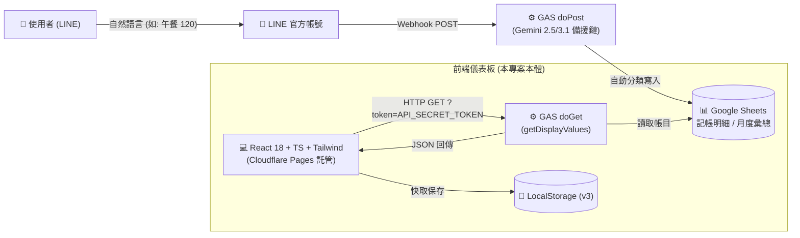

# 🤖 AGENTS.md — AI Agent 開發與專案架構指引 (Project Context & Rules)

> 本文件專為 **AI Coding Agents (如 Claude Code, Antigravity, Cursor, Windsurf, Copilot 等)** 撰寫。  
> 任何 AI Agent 進入本專案時，**必須優先閱讀本文件**，以了解整體端到端架構、業務規則、關鍵地雷（Gotchas）與設計規範。

---

## 🏛️ 1. 專案全貌與端到端架構 (End-to-End Architecture)

本專案是一個 **100% Serverless 的個人財務管理生態系**，分為兩大核心子系統：



### 技術棧 (Tech Stack)
- **前端框架**：React 18.3 (`src/App.tsx`) + TypeScript 5.7
- **構建工具**：Vite 6.1 (`vite.config.ts`)
- **樣式系統**：Tailwind CSS 3.4 + 自訂 Fintech 微光陰影 (`src/index.css`)
- **圖表函式庫**：Recharts 2.15 (BarChart, AreaChart, PieChart)
- **圖示庫**：Lucide React (`lucide-react`)
- **部署平台**：Cloudflare Pages (透過 GitHub `main` 分支自動 CI/CD，輸出目錄 `dist`)
- **後端與資料庫**：Google Apps Script (Web App) + Google Sheets

---

## 📁 2. 目錄結構與組件職責

```text
account_web/
├── AGENTS.md                  # [本文件] AI Agent 核心指引與架構指南
├── DESIGN.md                  # Revolut & Stripe 頂級金融設計規範
├── README.md                  # 專案介紹與使用者文檔
├── .gitignore                 # 嚴格排除 *.xlsx, *.csv, node_modules, dist
├── public/                    # 靜態資源目錄 (Cloudflare Pages 預設原生支援 SPA 路由回退，切勿放 /* /index.html 200 的 _redirects 避免 100324 迴圈報錯)
├── src/
│   ├── components/
│   │   ├── Header.tsx         # 頂部導覽、RWD 膠囊連線狀態、即時同步、記一筆按鈕
│   │   ├── MetricCards.tsx    # 4 大金融核心指標卡 (當月支出、前期比、半年均線、最高單筆)
│   │   ├── BurnRateCard.tsx   # 本月進度條、日均燒錢速率 (NT$/天)、月底推估結算
│   │   ├── InsightsPanel.tsx  # 純演算法生活洞察 (週末vs平日比、最花錢的日子、MoM變化)
│   │   ├── ExpenseCharts.tsx  # 柱狀/走勢雙視圖 + 類別甜甜圈圖 (支援 Drill-down 連動篩選)
│   │   ├── FilterBar.tsx      # 多維搜尋、月份選單、大額開關、日常模式開關 (≥$5k)
│   │   ├── TransactionList.tsx# 交易明細列表 (支援分頁、類別 Tag、大額醒目徽章)
│   │   ├── MonthlyBreakdownPage.tsx # 每月花費分析獨立頁 (堆疊柱狀圖 + 月份卡片 Grid)
│   │   ├── SyncModal.tsx      # Google Apps Script URL 與 Token 雲端設定彈窗
│   │   └── AddRecordModal.tsx # 本機手動補登記一筆彈窗
│   ├── types/
│   │   └── finance.ts         # TypeScript 介面 (Transaction, MonthlySummary, FilterState)
│   ├── utils/
│   │   ├── gasApi.ts          # GAS 連線、正規化、時區偏移修正 (重要！)
│   │   ├── demoData.ts        # 內建 50+ 筆擬真 Demo 資料 (保護真實隱私)
│   │   └── storage.ts         # LocalStorage 讀寫與快取版本遷移 (CACHE_VERSION)
│   ├── App.tsx                # 主應用狀態管理、Tab 切換、Drill-down 篩選派發
│   ├── main.tsx               # React 根渲染節點
│   └── index.css              # 全域樣式、字體與 Fintech 自訂 Utility
```

---

## ⚠️ 3. 關鍵業務規則與開發地雷 (Critical Gotchas)

### 🔴 地雷 1：時區跨日位移導致「月份倒退一個月」（已徹底根治，切勿改回）
- **現象**：Google Sheets 中的 Date 單元格在經由 Apps Script `JSON.stringify` 傳出時，為 **UTC ISO 字串**（如 `2026-08-31T16:00:00.000Z`，在台灣 UTC+8 實為 `2026-09-01`）。
- **絕對禁止**：直接使用 `s.slice(0, 7)` 切割字串！這會把 9 月硬生生截斷成 8 月，導致整條時間線全部倒退一個月。
- **正確做法**：
  1. 在 `gasApi.ts` 中使用 `normalizeMonthString(raw)`，透過 `new Date(s)` 轉為使用者本地時間提取年份與月份。
  2. 支援 Excel 日期序列號（如 `46266.0` ➜ `2026-09`），使用 `(num - 25569) * 86400 * 1000` 轉換。
  3. 修改資料結構或轉換邏輯時，**務必遞增 `storage.ts` 中的 `CACHE_VERSION`（如 `v3` ➜ `v4`）**，確保瀏覽器自動清空錯誤舊快取。

### 🔴 地雷 2：五大標準分類名稱絕對統一
- 系統內部與 Google Sheets 嚴格統一採用：**`['生活', '家用', '社交', '娛樂', '雜支']`**。
- **歷史糾正**：早期版本曾出現「生存」與「生活」混用，現已全面統一為 **「生活」**。任何新代碼請勿引入「生存」或其他非標準分類名。

### 🔴 地雷 3：離散月份 vs 平滑走勢圖失真
- 財務月份屬於離散週期。若當月剛開始（例如 9 月只過了 5 天，累積 $875），直接以連續曲線繪製會產生「斷崖式暴跌」的視覺假象。
- **最佳實踐**：
  - 預設推薦使用 **柱狀分佈圖 (`BarChart`)**。
  - 當月（進行中）必須給予視覺特化（如 `進行中` 標籤與特殊邊框），避免使用者誤以為支出崩跌。

### 🔴 地雷 4：個人隱私與機密資料隔離
- **絕對禁止將 `記帳.xlsx` 或任何真實財務檔案提交到 Git / GitHub**。
- 專案根目錄 `.gitignore` 必須隨時包含：`*.xlsx`, `*.xls`, `*.csv`, `node_modules/`, `dist/`。
- `API_SECRET_TOKEN` 與 GAS URL 僅允許存在於客戶端 `localStorage`，不得 hardcode 於任何前端檔案中。

---

## 🎨 4. 設計規範摘要 (Design Tokens)

詳見 [`DESIGN.md`](./DESIGN.md)，以下為速查摘要：
- **風格基調**：Revolut & Stripe 金融科技風格（白底、高呼吸感、1px 髮絲邊框、低彩度卡片）。
- **色彩 Token**：
  - 背景：`#F8FAFC` (`bg-slate-50`)
  - 卡片：`#FFFFFF` (`border border-slate-200/80 rounded-3xl shadow-sm`)
  - 核心字色：`#0F172A` (`text-slate-900`)，副字色：`#64748B` (`text-slate-500`)
  - 翡翠綠 (Primary)：`#0D9488` (`teal-600`)
  - 冷靛藍 (Accent)：`#6366F1` / `#4F46E5` (`indigo-600`)
  - 琥珀橘 (Warning / 大額)：`#F59E0B` (`amber-500`)
  - 玫瑰紅 (負向 / 超支)：`#E11D48` (`rose-600`)
- **數字規範**：所有金額數值必須強制加上 **`tabular-nums`**（避免跳動對齊）與 **`tracking-tight`**。

---

## 🛠️ 5. 開發與建置常用指令 (Commands)

```bash
# 1. 安裝套件
npm install

# 2. 啟動本機開發伺服器 (附 HMR 熱更新)
npm run dev

# 3. 生產環境完整建置 (先執行 TypeScript 檢查再由 Vite 打包)
npm run build

# 4. 本地預覽生產建置結果
npm run preview
```

---

## 🚀 6. CI/CD 與 Cloudflare Pages 自動發布規範

- **觸發條件**：推送到 GitHub 倉庫的 `main` 分支。
- **Cloudflare Build 設定**：
  - **Framework preset**：`Vite`
  - **Build command**：`npm run build`
  - **Build output directory**：`dist`
- **SPA 路由**：Cloudflare Pages 在沒有 `404.html` 時，原生預設自動將所有非靜態檔案路由回退至 `index.html`，無需且不可建立 `/* /index.html 200` 之 `_redirects`（否則會觸發 Wrangler 100324 無限迴圈報錯）。
