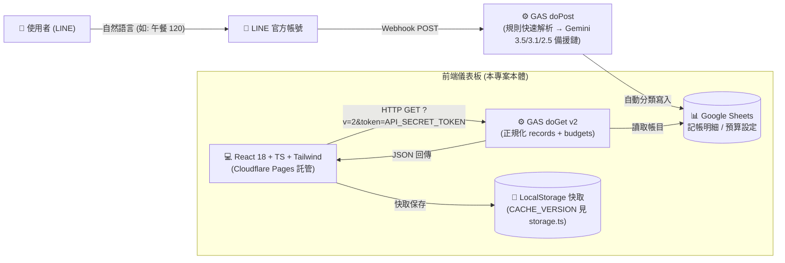

# 🤖 AGENTS.md — AI Agent 開發與專案架構指引 (Project Context & Rules)

> 本文件專為 **AI Coding Agents (如 Claude Code, Antigravity, Cursor, Windsurf, Copilot 等)** 撰寫。  
> 任何 AI Agent 進入本專案時，**必須優先閱讀本文件**，以了解整體端到端架構、業務規則、關鍵地雷（Gotchas）與設計規範。

---

## 🏛️ 1. 專案全貌與端到端架構 (End-to-End Architecture)

本專案是一個 **100% Serverless 的個人財務管理生態系**，分為兩大核心子系統：


```mermaid
flowchart LR
    User["👤 使用者 (LINE)"] -->|"自然語言 (如: 午餐 120)"| LineBot["💬 LINE 官方帳號"]
    LineBot -->|"Webhook POST"| GAS_POST["⚙️ GAS doPost<br/>(規則快速解析 → Gemini 3.5/3.1/2.5 備援鏈)"]
    GAS_POST -->|"自動分類寫入"| Sheet[("📊 Google Sheets<br/>記帳明細 / 預算設定")]

    subgraph "前端儀表板 (本專案本體)"
        Web["💻 React 18 + TS + Tailwind<br/>(Cloudflare Pages 託管)"]
        Web -->|"HTTP GET ?v=2&token=API_SECRET_TOKEN"| GAS_GET["⚙️ GAS doGet v2<br/>(正規化 records + budgets)"]
        GAS_GET -->|"讀取帳目"| Sheet
        GAS_GET -->|"JSON 回傳"| Web
        Web -->|"快取保存"| LocalStorage[("💾 LocalStorage 快取<br/>(CACHE_VERSION 見 storage.ts)")]
    end
```

### 技術棧 (Tech Stack)
- **前端框架**：React 18.3 (`src/App.tsx`) + TypeScript 5.7
- **構建工具**：Vite 6.1 (`vite.config.ts`)
- **樣式系統**：Tailwind CSS 3.4 + 自訂 Fintech 微光陰影 (`src/index.css`)
- **圖表函式庫**：Recharts 2.15 (BarChart, AreaChart, PieChart)
- **圖示庫**：Lucide React (`lucide-react`)
- **部署平台**：Cloudflare Pages (透過 GitHub `main` 分支自動 CI/CD，輸出目錄 `dist`)
- **後端與資料庫**：Google Apps Script (Web App) + Google Sheets

---

## 📁 2. 目錄結構與組件職責

```text
account_web/
├── AGENTS.md                  # [本文件] AI Agent 核心指引與架構指南
├── DESIGN.md                  # Revolut & Stripe 頂級金融設計規範
├── README.md                  # 專案介紹與使用者文檔
├── .gitignore                 # 嚴格排除 *.xlsx, *.csv, node_modules, dist
├── public/                    # 靜態資源目錄 (Cloudflare Pages 預設原生支援 SPA 路由回退，切勿放 /* /index.html 200 的 _redirects 避免 100324 迴圈報錯)
├── gas/
│   ├── Code.gs                # GAS 後端：LINE doPost（白名單/多筆/撤銷）+ 儀表板 doGet（v1/v2）
│   └── appsscript.json        # GAS 專案設定（時區、V8、網頁應用程式權限）
├── scripts/deploy-gas.mjs     # npm run gas:deploy：clasp 推送 → 新版本 → 更新固定部署
├── src/
│   ├── components/
│   │   ├── Sidebar.tsx        # 桌機左側導覽（項目來自 constants/navigation.ts）、連線狀態、雲端設定
│   │   ├── BottomNav.tsx      # 手機/平板底部導覽列（< lg），與側欄共用 NAV_ITEMS
│   │   ├── CalendarPage.tsx   # 消費月曆熱圖：每日顏色相對近 3 個月日均，點日期看當天明細
│   │   ├── ReviewPage.tsx     # 月度回顧：總額 vs 平均、類別占比、最大一筆、最常記項目、星期分布、連續記帳
│   │   ├── TopGreetingBar.tsx # 問候語、分析月份選單、同步按鈕
│   │   ├── MonthOverviewCard.tsx # 手機首屏：本月已花、預算剩餘、最近 5 筆
│   │   ├── DashboardSkeleton.tsx # 首次載入（無快取）時的骨架畫面
│   │   ├── MetricCards.tsx    # 4 大 KPI（當月支出 vs 上月同期、半年均線、最高單筆、月底推估）
│   │   ├── ExpenseCharts.tsx  # 柱狀/走勢雙視圖 + 類別甜甜圈圖 (支援 Drill-down 連動篩選)
│   │   ├── MonthCumulativeChart.tsx # 當月每日累計支出 vs 上月同期 vs 預算進度（單一 Y 軸，進行中月份止於今天）
│   │   ├── BudgetProgressPanel.tsx # 類別支出進度 + 週末/平日洞察
│   │   ├── TransactionList.tsx# 交易明細列表 (分頁、類別 Tag、搜尋、排序、大額徽章)
│   │   ├── MonthlyBreakdownPage.tsx # 每月花費分析頁（延遲載入）：期間切換、摘要卡、固定順序堆疊圖（可單獨比較類別）、各類別小圖、月份卡
│   │   └── SyncModal.tsx      # Google Apps Script URL 與 Token 雲端設定彈窗
│   ├── constants/categories.ts# 五大分類與舊分類對照 normalizeCategory
│   ├── constants/categoryIcons.ts # 每個分類一個專屬 Lucide 圖示（禁止用 emoji 當圖示）
│   ├── constants/navigation.ts # 頁面清單 NAV_ITEMS / AppTab（側欄與底部導覽唯一來源）
│   ├── hooks/useNow.ts        # 每分鐘更新的現在時間（相對時間顯示用）
│   ├── theme/tokens.ts       # 設計 Token（顏色唯一來源，Tailwind 與 Recharts 共用）
│   ├── types/finance.ts       # TypeScript 介面 (Transaction, MonthlySummary, FilterState)
│   ├── utils/
│   │   ├── gasApi.ts          # GAS 連線；v2 records 與 v1 顯示字串兩種格式的正規化
│   │   ├── dateUtils.ts       # 上午/下午、序列號、ISO 等日期解析
│   │   ├── financeCalculations.ts # 月彙總、半年均線、上月同期比較
│   │   ├── calendarReview.ts  # 月曆熱圖與月度回顧的純函式（日均基準、熱度等級、常記項目、連續記帳）
│   │   ├── demoData.ts        # 內建擬真 Demo 資料 (保護真實隱私)
│   │   ├── storage.ts         # LocalStorage 讀寫與快取版本遷移 (CACHE_VERSION)
│   │   └── __tests__/         # Vitest 回歸測試（地雷 1、2、5 都有覆蓋，TZ 固定 Asia/Taipei）
│   ├── App.tsx                # 狀態管理：先顯示快取、背景同步 GAS（applyCloudData）
│   ├── main.tsx               # React 根渲染節點 + PWA Service Worker 註冊
│   └── index.css              # 全域樣式、字體與 Fintech 自訂 Utility
```

---

## ⚠️ 3. 關鍵業務規則與開發地雷 (Critical Gotchas)

### 🔴 地雷 1：時區跨日位移導致「月份倒退一個月」（已徹底根治，切勿改回）
- **現象**：Google Sheets 中的 Date 單元格在經由 Apps Script `JSON.stringify` 傳出時，為 **UTC ISO 字串**（如 `2026-08-31T16:00:00.000Z`，在台灣 UTC+8 實為 `2026-09-01`）。
- **絕對禁止**：直接使用 `s.slice(0, 7)` 切割字串！這會把 9 月硬生生截斷成 8 月，導致整條時間線全部倒退一個月。
- **正確做法**：
  1. 在 `gasApi.ts` 中使用 `normalizeMonthString(raw)`，透過 `new Date(s)` 轉為使用者本地時間提取年份與月份。
  2. 支援 Excel 日期序列號（如 `46266.0` ➜ `2026-09`），使用 `(num - 25569) * 86400 * 1000` 轉換。
  3. 修改資料結構或轉換邏輯時，**務必遞增 `storage.ts` 中的 `CACHE_VERSION`（如 `v3` ➜ `v4`）**，確保瀏覽器自動清空錯誤舊快取。

### 🔴 地雷 2：五大標準分類名稱絕對統一
- 系統內部與 Google Sheets 嚴格統一採用：**`['生活', '家用', '社交', '娛樂', '雜支']`**。
- **歷史糾正**：早期版本曾出現「生存」與「生活」混用，現已全面統一為 **「生活」**。任何新代碼請勿引入「生存」或其他非標準分類名。

### 🔴 地雷 3：離散月份 vs 平滑走勢圖失真
- 財務月份屬於離散週期。若當月剛開始（例如 9 月只過了 5 天，累積 $875），直接以連續曲線繪製會產生「斷崖式暴跌」的視覺假象。
- **最佳實踐**：
  - 預設推薦使用 **柱狀分佈圖 (`BarChart`)**。
  - 當月（進行中）必須給予視覺特化（如 `進行中` 標籤與特殊邊框），避免使用者誤以為支出崩跌。

### 🔴 地雷 4：個人隱私與機密資料隔離
- **絕對禁止將 `記帳.xlsx` 或任何真實財務檔案提交到 Git / GitHub**。
- 專案根目錄 `.gitignore` 必須隨時包含：`*.xlsx`, `*.xls`, `*.csv`, `node_modules/`, `dist/`。
- `API_SECRET_TOKEN` 與 GAS URL 僅允許存在於客戶端 `localStorage`，不得 hardcode 於任何前端檔案中。

### 🔴 地雷 5：Google Sheets 千分位格式 (`#,##0`) 導致 `parseFloat` 截斷金額 (如 1,500 變 1)
- **現象**：Google Sheets 金額欄位若設定千分位格式（`#,##0`），GAS `getDisplayValues()` 回傳字串會自帶逗號（如 `"1,500"`）。
- **絕對禁止**：直接對原始字串呼叫 `parseFloat(str)`！在 JavaScript 中，`parseFloat("1,500")` 遇到逗號會立刻終止解析並返回 `1`，造成所有破千金額嚴重失真（例如 1,500 變 1、20,103 變 20）。
- **正確做法**：統一使用 `parseAmount(raw)`，先過濾除數字與小數點外的千分位逗號（`replace(/[,，]/g, '')`）再轉為數字，且修改時遞增 `storage.ts` 快取版本清除舊快取。

### 🔴 地雷 6：GAS 資料格式 v1 / v2
- 前端呼叫 doGet 一律帶 `v=2`。新版 GAS 回傳 `records: [{id, date, item, category, amount, month}]`：日期已用 `Asia/Taipei` 格式化為 `yyyy-MM-dd HH:mm:ss`、金額為數字、`id` 為試算表列號（`r12`）。
- 舊版 GAS 會忽略 `v` 並回傳 `details`（`getDisplayValues()` 二維字串陣列），前端仍以 `normalizeGasDetails` 相容處理。兩條路徑都要保留，直到確認線上 GAS 已更新。
- 「月度彙總」工作表不再由程式累加；前端月總額一律從明細計算（`calculateDynamicMonthlySummaries`）。
- 「不固定大額支出」分頁（標題列含「項目」「金額」，可選「日期」）由 `readIrregular` 讀取，doGet v2 回傳 `irregular`。**刻意不計入任何每月總額、平均或圖表**，只在每月花費分析頁的獨立卡片顯示。
- LINE 端：`ALLOWED_USER_IDS` 指令碼屬性為白名單（留空不限制）；「我的ID」查 userId、「撤銷」刪除上一批 LINE 寫入（會先比對內容）。寫入一律包在 `LockService` 內。
- LINE 解析分兩層：`parseSimpleRecords` 先以規則處理「項目 金額」（分類靠 `CATEGORY_KEYWORDS`），只要有日期詞、運算或認不出分類就回傳 null 交給 Gemini。新增常用店家請加到 `CATEGORY_KEYWORDS`。
- 線上只維護一個部署「Claude最新版」（`AKfycbyCVO01…`），LINE Webhook 與前端都連它；其他舊部署未封存但已不使用。
- **GAS 一律用 clasp 部署**：改完 `gas/Code.gs` 執行 `npm run gas:deploy -- 說明`，會推送 `gas/`、建立新版本並把「Claude最新版」部署指向它（網址不變）。不要再手動貼到網頁編輯器，也不要在編輯器另外部署，以免 repo 與線上不一致。
- clasp 設定檔 `.clasp.json`（scriptId）與 `.gas-deploy.json`（部署 ID）含線上端點，**已 gitignore、不可提交**（repo 為公開）；新環境參考 `*.example` 建立，並先 `npx clasp login`。`gas/appsscript.json` 是線上專案設定的版控來源。

---

## 🎨 4. 設計規範摘要 (Design Tokens)

詳見 [`DESIGN.md`](./DESIGN.md)，以下為速查摘要：
- **風格基調**：暖米白底的金融科技風格（1px 髮絲邊框、低彩度白卡、深色側欄 + 金色強調）。
- **色彩 Token**：唯一來源是 `src/theme/tokens.ts`，透過 `tailwind.config.ts` 提供 `bg-canvas`、`border-line`、`text-ink-muted`、`bg-primary`、`bg-gold`、`bg-night` 等 class；Recharts 直接 import `palette` / `categoryColor`。**元件內禁止寫死 hex 色碼。**
- **預算**：來自試算表「預算設定」分頁（doGet v2 的 `budgets`），未設定的類別以半年均值比例當「參考」值（`resolveCategoryBudgets`）。
- **手機首屏**：`MonthOverviewCard`（本月已花 / 預算剩餘 / 最近 5 筆），僅在 `< sm` 顯示。
- **導覽**：手機與平板用底部導覽列（`BottomNav`），桌機用側欄；新增頁面只改 `constants/navigation.ts`。月曆熱圖用 `heatScale`，深色卡片上的類別色用 `categoryColorsOnDark`。
- **數字規範**：所有金額數值必須強制加上 **`tabular-nums`**（避免跳動對齊）與 **`tracking-tight`**。

---

## 🛠️ 5. 開發與建置常用指令 (Commands)

```bash
# 1. 安裝套件
npm install

# 2. 啟動本機開發伺服器 (附 HMR 熱更新)
npm run dev

# 3. 生產環境完整建置 (先執行 TypeScript 檢查再由 Vite 打包)
npm run build

# 4. 本地預覽生產建置結果
npm run preview

# 5. 執行解析/日期/金額回歸測試 (Vitest)
npm test

# 6. 部署 GAS 後端（推送 gas/ → 新版本 → 更新固定部署，網址不變）
npm run gas:deploy -- 這次改了什麼
```

---

## 🚀 6. CI/CD 與 Cloudflare Pages 自動發布規範

- **觸發條件**：推送到 GitHub 倉庫的 `main` 分支。
- **Cloudflare Build 設定**：
  - **Framework preset**：`Vite`
  - **Build command**：`npm run build`
  - **Build output directory**：`dist`
- **SPA 路由**：Cloudflare Pages 在沒有 `404.html` 時，原生預設自動將所有非靜態檔案路由回退至 `index.html`，無需且不可建立 `/* /index.html 200` 之 `_redirects`（否則會觸發 Wrangler 100324 無限迴圈報錯）。
